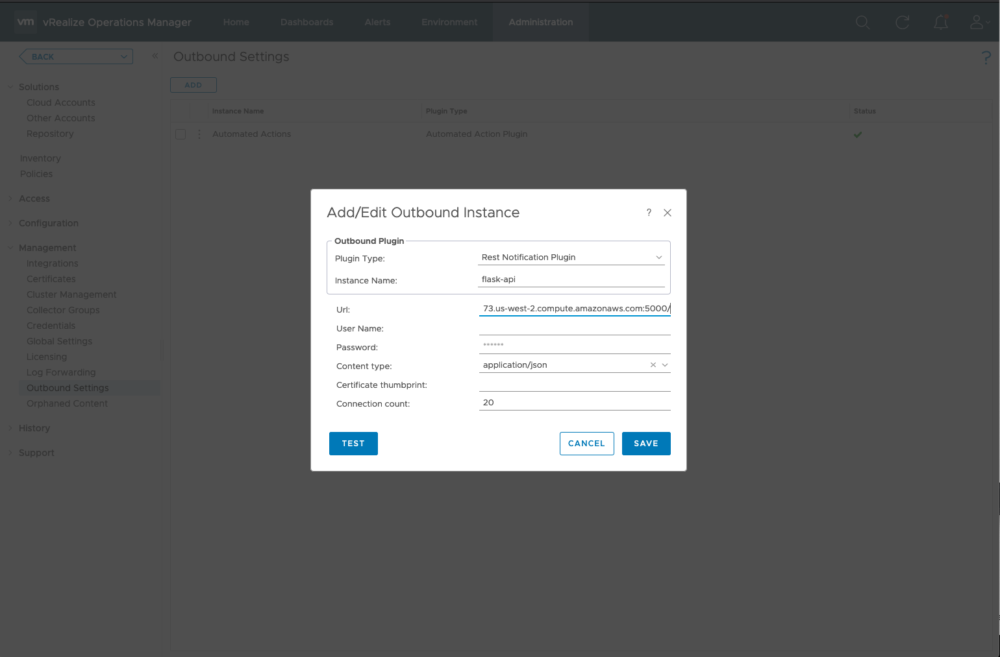
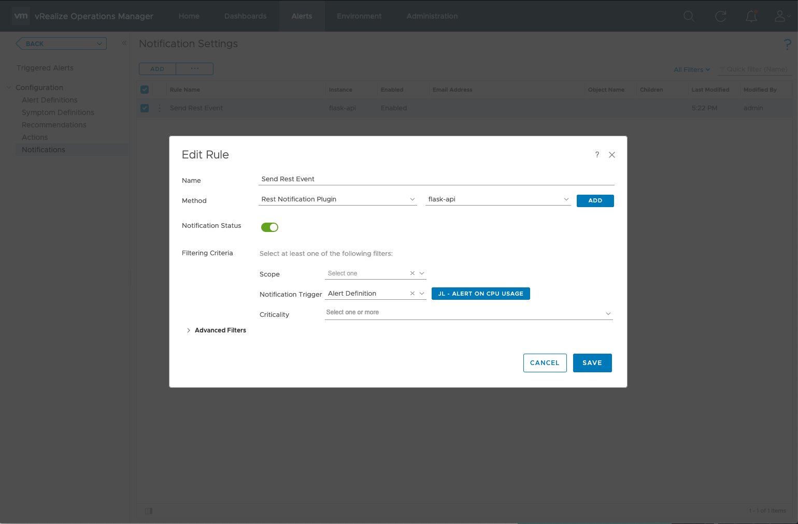
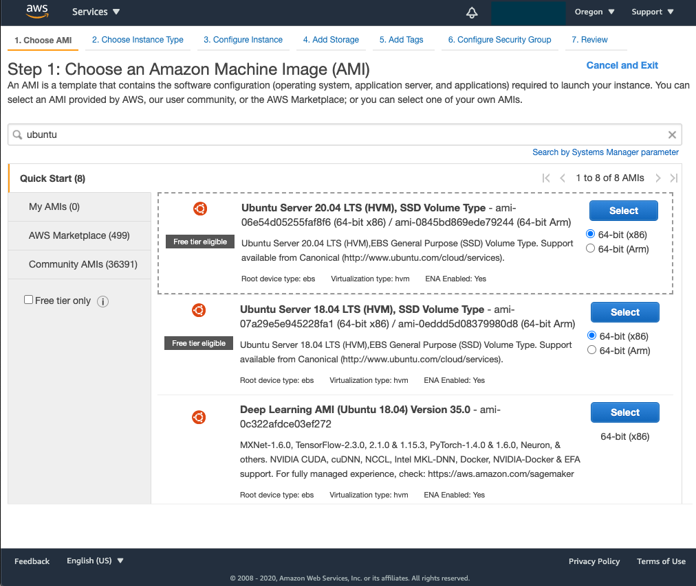
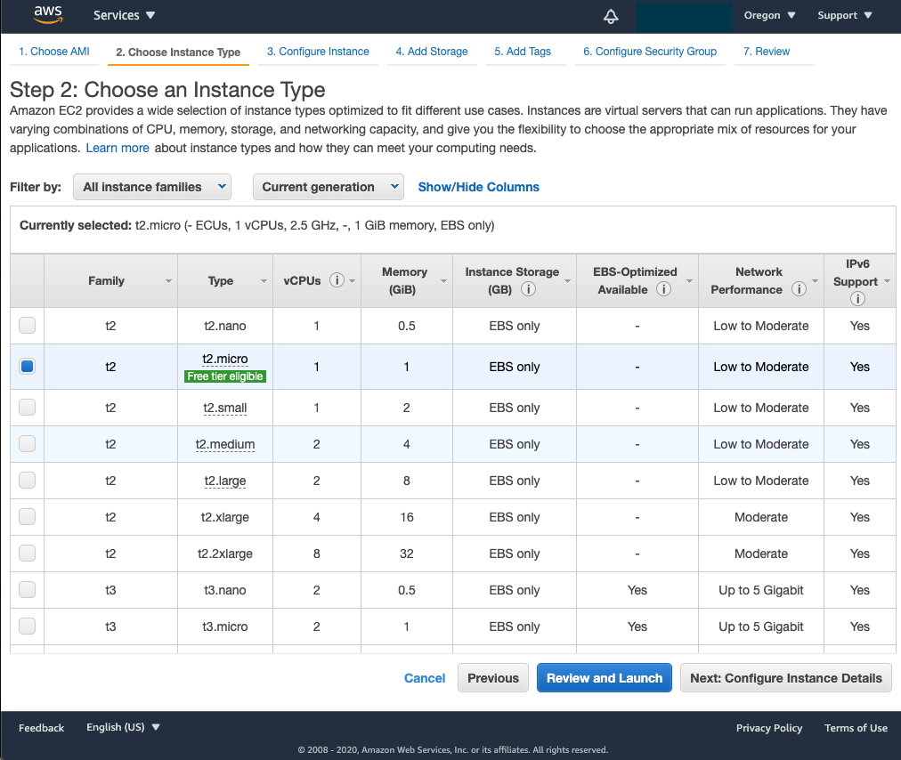
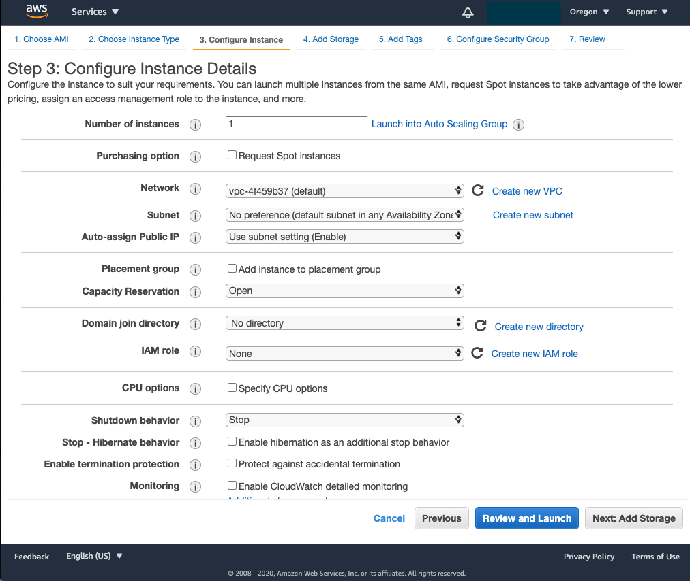
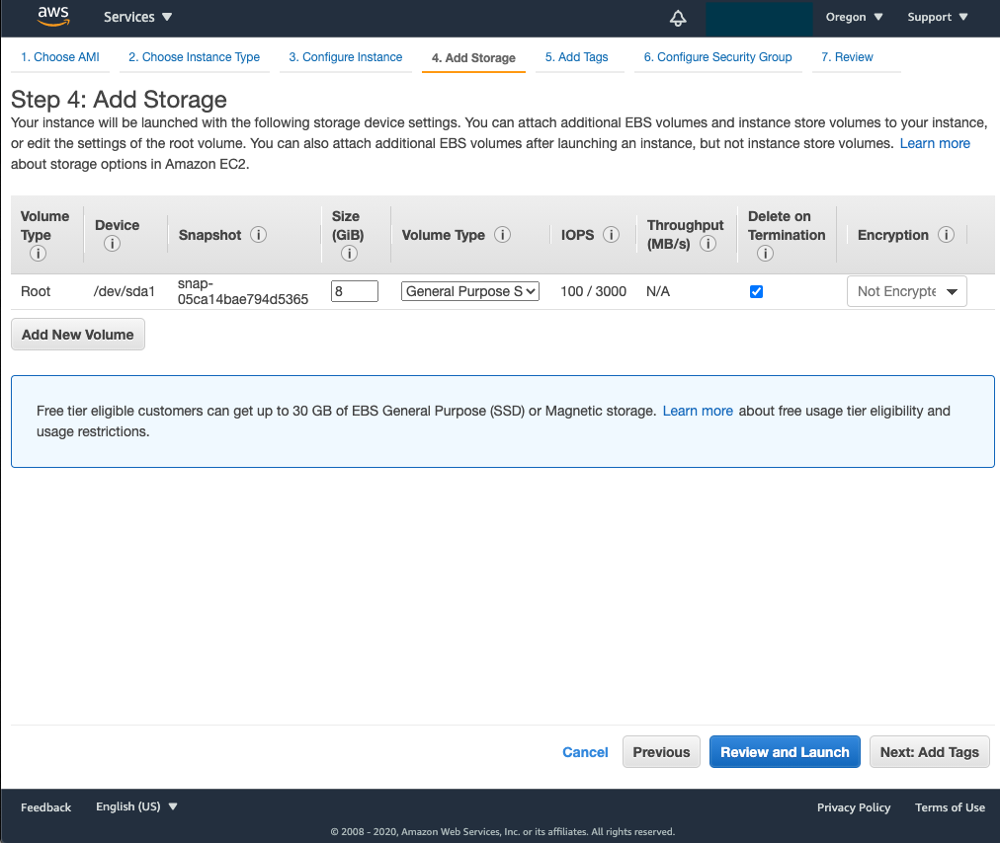
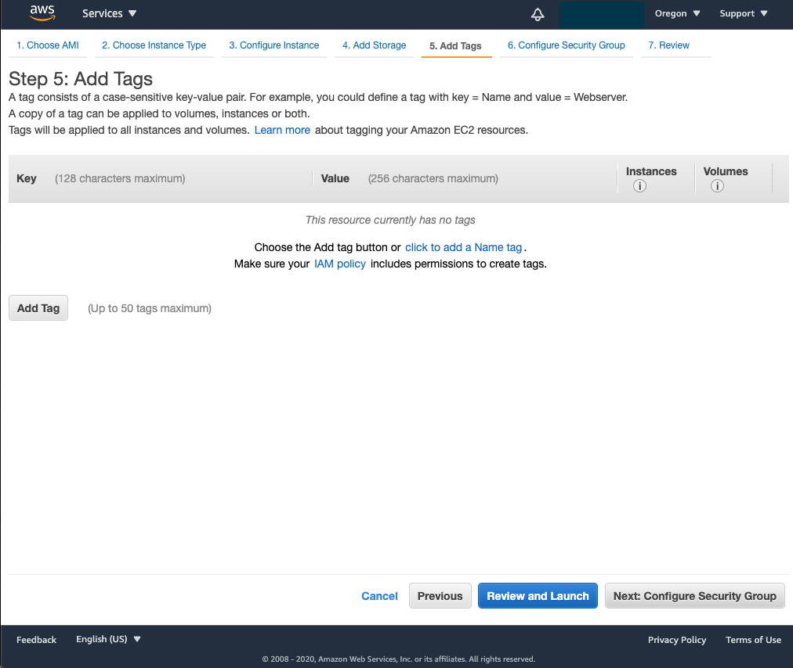
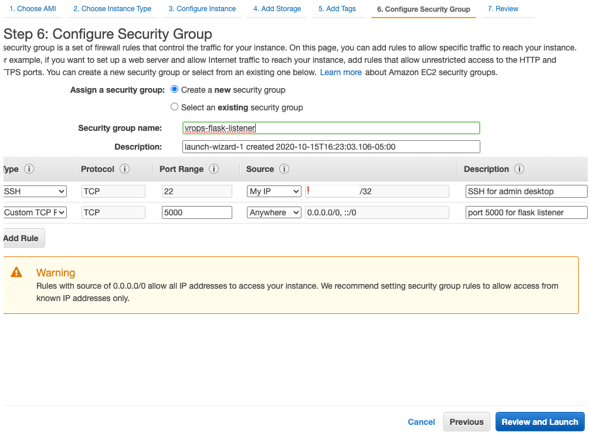
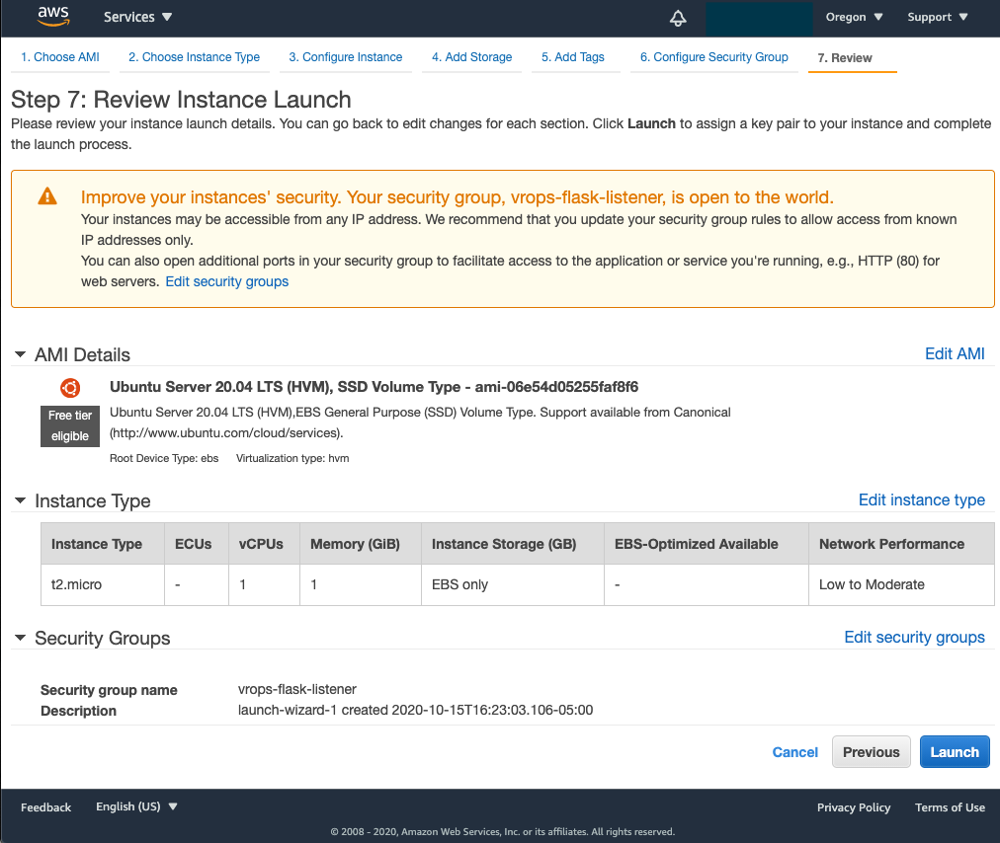

# vrops-event-echo
A simple webhook shim for echoing vR Ops alerts, which can be used to later send to other systems such as Splunk via HEC

This is completely based on https://github.com/prydin/vrops-splunk.git.  Thanks @prydin! 

## Installing
Ensure you have pip or pip3 available on your system.  For Ubuntu 20.04, that looks like:

```
sudo apt update && apt upgrade
sudo apt install python3-pip
```

Once that's complete:
```
git clone https://github.com/jlemmon/vrops-event-echo.git
cd vrops-event-echo
pip3 install -r requirements.txt
```

Note: On Mac, you may have to replace ```pip3``` with ```pip```

## Usage
Start the server using the following commands:

```
flask run --host=0.0.0.0
```

## Set up vROps
Once you have the server running, you can set up your server as a target for vROps events.  You do this by:
1) Configuring a REST Notification plugin under Administration --> Management --> Outbound Settings

2) Creating a notification that uses that plugin


# EC2 Setup
If you need to try this in EC2, here's a quick walkthrough:
1. Create Ubuntu Instance








(Use all defaults except for security groups)

1. Configure your security groups to allow traffic on port 5000


